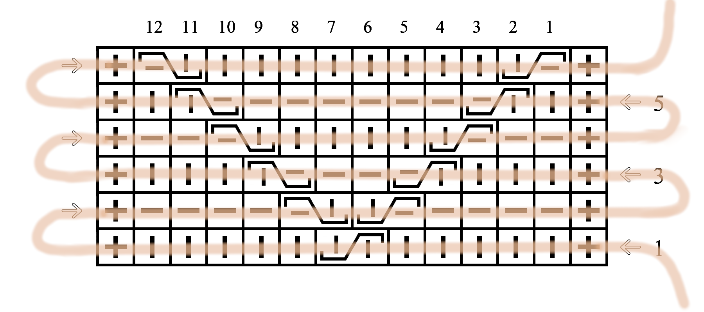
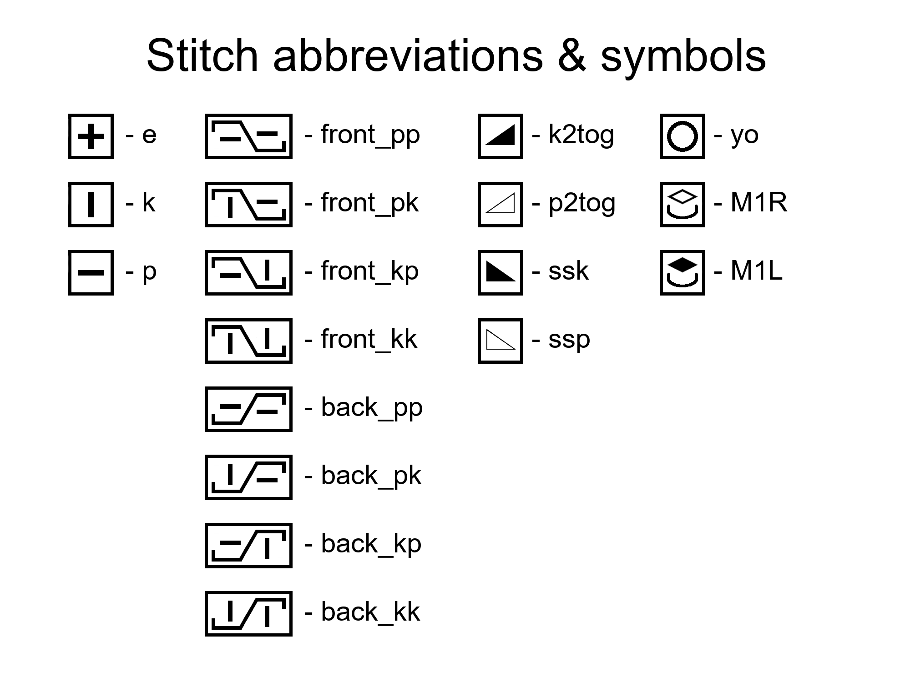

## **Content**
1. [What's a knitting chart?](#what's-a-knitting-chart?)
2. [Purpose](#purpose)
3. [Stitches](#stitches)
4. [How to use this program](#how-to-use-this-program)
    * [Creating pattern](#creating-pattern)
    * [Colouring the chart](#colouring-the-chart)

## **What's a knitting chart?**

A knitting chart is a graphical representation of a knitting pattern, where each stitch is given by a unique symbol. Stitches occure subsequentially in a pattern, that's why we can compare a knitting chart to a roadmap, which tells us what's the next stitch and helps to keep track of the pattern.

Charts are divided into columns and rows. The first row is located at the bottom of the chart, and the following rows appear above the previous one (they increase from bottom to top). Reading stitches within a row depends on whether it's an odd or even row. Wrong-side rows are even rows, and right-side rows are odd rows. Therefore, odd rows are read from right side to left side, and even rows are read from left side to right side. Numbers of the odd (right-side) rows appear on the right side of the chart. Column numbers appear in the top part of the chart. Columns are numbered from right to left side, according to direction of reading right-side rows. Noticeably, the direction of reading stitches in even rows, is from the last column to the first column.

## **Purpose**

The following program was created for generating knitting charts. Since I wrote that script for a purpose of creating charts for making knitting squares that will eventually be assembled into one blanket, all charts saved in the project are of the same size, which is 36 columns x 48 rows (stitches are wider than taller, so in order to form a square I had to add more rows than columns). However, it's worth noticing that the numbers of columns and rows are chosen individually for each chart. Therefore, users can customize the number of columns and rows to suit their specific project needs.

## **Stitches**

In this project I use dashed stitch symbols, which are commonly used in eastern Europe. In this type of charts, both knit stitches and purl stitches are marked with the same symbols on right side and wrong side. It's important to mention that stitches used by knitters and designers might differ from each other. That's why a good advice is to always make yourself familiar with the symbols and abbreviations. For this project, I've created stitch symbols using Gimp. For majority of cases, I tried to use English abbreviations. The only exception is the group of cable stitches, for which I decided to use names which explain how the cable was made. Though it's possible to use English nomenclature with names such as RC, LC, etc., I think the ones chosen by me are more descriptive.

### **Basic stitches**:
* edge stitch: **e**
* purl stitch: **p**
* knit stitch: **k**

### **Cable stitches**: 
They are formed by twisting one stitch over another stitch (it is possible to twist several stitches). The basic technique involves temporarily holding the first stitch to the **front** or **back** of the work on a supportive needle. The stitches can be either **purl stitches** or **knit stitches**, depending on the effect we want to achieve. We read the stitches according to the direction of the row. The first part of the name specifies whether supportive needle should be put to the '**front**' or '**back**', and after a separation by '**_**' the two stitches are given ('**kk**', '**kp**', '**pk**', or '**pp**'), assuming the direction of reading as in right-side rows.

### **Decresing stitches** (two stitches which turned into one):
* knit two together: **k2tog**
* purl two together: **p2tog**
* slip, slip, knit: **ssk**
* slip, slip, purl: **ssp**

### **Increasing stitches** (creating new stitches within a row):
* yarn over: **yo**
* make one right: **M1R**
* make one left: **M1L**

The figure below shows all the stitches possible to use in this program:

## **How to use this program**

The very first things to do in the program, are to import Pillow library and create 'stitch_library', which is done be running the script in the section 'Stitches library and symbols'.

While creating the chart, we will create two files:
* 'pattern.txt' file, which provide information about type and location of stitches
* 'ranges.txt' file, which purpose is to colour the pattern in order to improve its visibility

### **Creating pattern**

To create the file 'pattern.txt', we need to know how the program reads it:
1. Each stitch symbol written in the file will be converted into an image, based on the 'stitch_library' (it might be also looked up on the legend above).
2. Stitches are separated by commas. There is no comma after the last stitch in a row.
3. If we want to repeat the same stitches, we can follow the symbol by the number of occurences, e.g. if we want to have **6 purl stitches**, we write it as **p6**.
4. If we decide to use edge stitches, we need to start and end every line with **e**.
5. The number of line in the file 'pattern.txt' coresponds to the row in a chart.
6. Every line in the file will be read from left to right, but the stitches will occure in the chart from right to left (in both even rows and odd rows).

Based on the created 'pattern.txt' file, we can create 'Pattern' dictionary. We will use for that 'Script for reading stitches from a file' section, which will read the stitches from the file. While running the script, we will be asked to:
* give the number of stitches per row: the number of stitches per row is the total sum of stitches per row, e.g. for 'e, p6, e' it's equal to 8
* to give the number of rows: the number of lines in the file corresponds to the number of rows in the chart
* the name of the chart

Having the dictionary 'Pattern' finished, we can generate the chart using script from section 'Creating the chart'. We will be asked whether we want to put a **repeat section**. If we can find a piece of the pattern which repeats itself, then that's what called a repeat section. Typically, in charts representing such patterns, only one repeated section is left and marked accordingly. It is especially useful for scarfs, where the same boxes of pattern are repeated multiple times. However, we can also find examples of repeated sections in patterns provided in this project. Below I put an example of a coloured chart from pattern called *Squared*.

### **Colouring the chart**

We can provide some better visibility by colouring the chart (as on the example above). In order to do that, we will need to create the file 'ranges.txt' in which we will specify which ranges of stitches in each row will be coloured. The program will read the file according to the following rules:
1. A range of stitches per row is specified by writing the beginning of the column and the last column separated by a dash, e.g. '**1-10**'.
2. If we want to have a few ranges per row, we separate them by commas, e.g. '**1-10, 12-15**'.
3. The number of line in the file 'ranges.txt' responds to the row in a chart.
4. If we don't want to put any colour in a row, then we leave the corresponding line empty.
5. We can add one colour in one colouring, but we can commit the colouring more than once, adding different colours each time. 

We colour the chart using script from section 'Colouring the chart'. The original black and white chart will remain, and the coloured chart will be saved as additional file, with the addition to its name '_colour'. It is worth noticing that it is possible to add **multiple colours**. In order to do so, we will need to create another 'ranges.txt.' file, to colour different areas of the chart. We can use the coloured chart once again by using the commanded line 'img = Image.open(chart_name + '_colour' + '.png')'. This time, the new coloured chart will replace the previous colored chart because their names are the same.

After finishing creating the chart, we save all the information regarding to the chart in one text file, which will be put into one folder with the charts. The text file should consist of the following information:
* pattern
* colour ranges
* used colours
* repeat sections

Saving this information will enable to recreate the chart or modify it, if it's needed.
